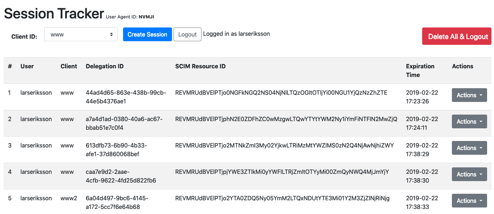

# Session Tracker Example

This project shows how sessions created in various client applications can be tracked and managed using Curity. It is meant to prove a concept only.

## Setup

To run this sample, make sure that Flask is installed. Also, Curity will need to be installed. The [test authenticator](https://github.com/curityio/testing/tree/master/test-authenticator) is used in the sample config. If that isn't installed, the sample configuration will not be valid, and Curity will reject it. With these prequisits fullfilled, start the app:

```bash
$ python app.py 
``` 

This will open the Session Tracker app on [http://localhost:5555](http://localhost:5555). 

## Usage

To start with, just create a new session by clicking the `Create Session` button. This will initiate the code flow with the client ID selected from the dropdown box. (This will only work if the client IDs are configured in Curity; refer to the [sample config](example-config.xml).) After login, the app will exchange the code that is sent back and fetch all the delegations for that user. It will get these delegrations by calling the delegations endpoint in the Curity SCIM server that is also configured in the sample config.

 

At this point, the user's sessions (delegrations really) are displayed. The client ID that was used will be displayed together with the SCIM resource ID, expiration time, and a list of actions. The actions allow the tester to:

* Refresh the token;
* Introspect it; and
* Delete it.

This can be helpful for checking if the token's root delegation is still active. If it is, introspection and refreshing should be possible; if they are, a little toast popup will be displayed in the top-right corner saying so. These functions may not work, however, if the token was obtained in a different application (i.e., a different web browser). In that case, examination of the token will not work, but deleting it can still be done. If the delete action is executed, the _delegation not the token_ will be deleted. This will cause all associated tokens to be invalidated. 

Also, it is possible to remove all delegations for a user. If this is done, all delegations and every child of it (access tokens, refresh token, etc.) will be revoked. This will effectively revoke all API access. This is done by performing a delete call on the SCIM API of each delegation resource. After this, logout is performed.

Note that:

* Logout is for the current application, not all currently active login sessions. 
* Any by-value token (like a JWT access token or ID token) may still be used by a client that isn't aware that the delegation should be removed. This should not be a problem if the [phantom token](https://developer.curity.io/tutorials/introspect-with-phantom-token) pattern is followed.

Use the application to test from multiple browsers and multiple devices to see how sessions can be managed by a user. Doing similarly for an administrator who can view and delete all active sessions for different users would be done in a similiar fashion. 

## License

This sample is lisensed according to conditions in the [MIT 0-attribution license](LICENSE). Pull requests are welcome. Copyright 2019 Curity AB. 